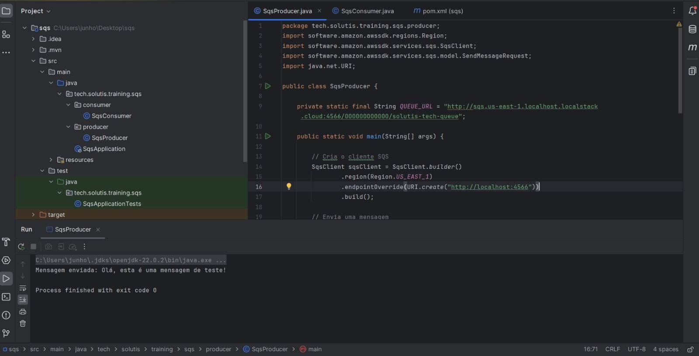

# SQS LocalStack Solution

Este projeto faz parte do treinamento Solutis Dev Trail e demonstra como criar e interagir com filas Amazon SQS utilizando o LocalStack. O LocalStack é uma ferramenta que emula serviços da AWS, permitindo que os desenvolvedores testem suas aplicações localmente.

## Estrutura do Projeto

O projeto contém duas classes principais:

- **SqsProducer:** Responsável por enviar mensagens para a fila SQS.
- **SqsConsumer:** Responsável por receber e processar mensagens da fila SQS.

### Funcionalidade

1. **Criação da Fila:** A fila chamada `solutis-tech-queue` é criada utilizando comandos AWS no LocalStack.
2. **Envio de Mensagens:** O `SqsProducer` envia uma mensagem de teste para a fila.
3. **Recebimento de Mensagens:** O `SqsConsumer` recebe e processa as mensagens da fila, excluindo-as após o processamento.

### Ajustes Realizados

Durante o desenvolvimento do projeto, foram feitas as seguintes alterações:

- **Importação de `java.net.URI`:** Foi adicionada a importação da classe `URI` para configurar corretamente o endpoint do LocalStack.
- **Configuração do Endpoint:** A configuração do cliente `SqsClient` foi atualizada para incluir o endpoint do LocalStack. Isso permite que o cliente se conecte ao emulador local.

### Evidência de funcionamento:

[]

--------------------

## contatos:

 
    
       

